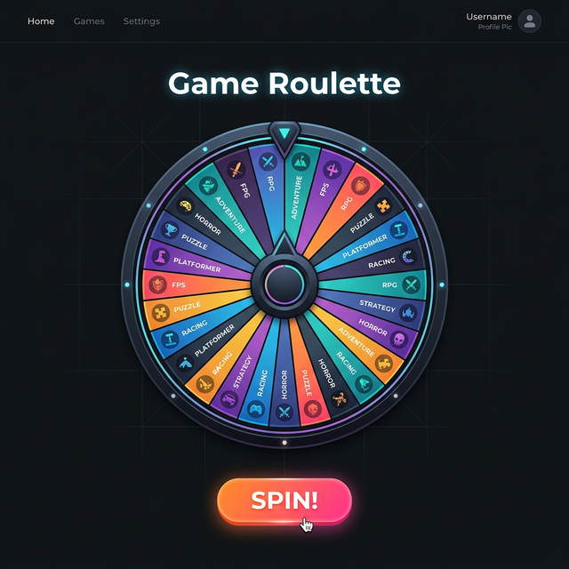
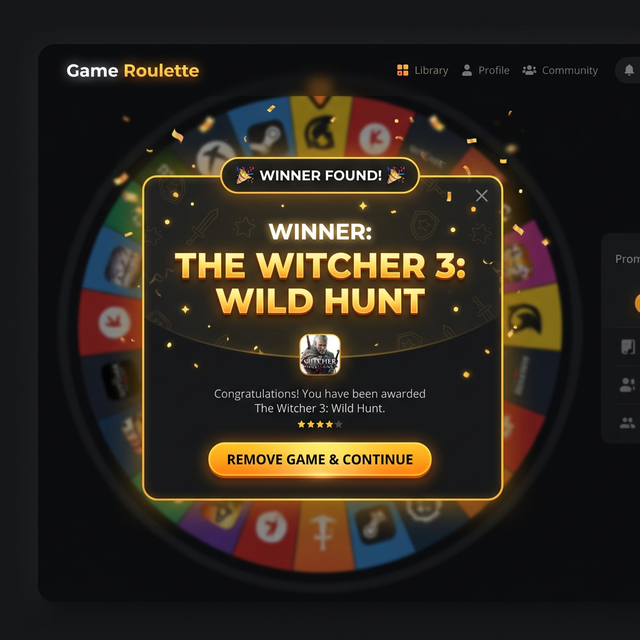
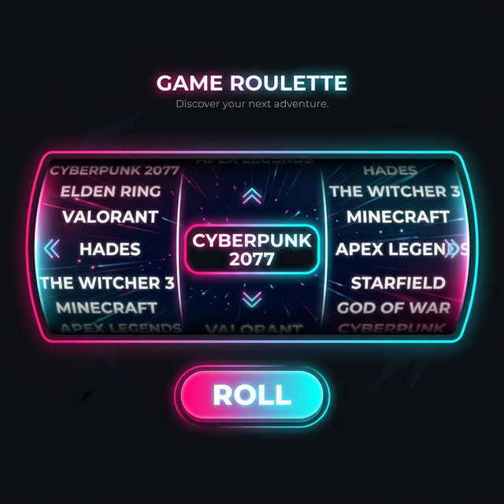
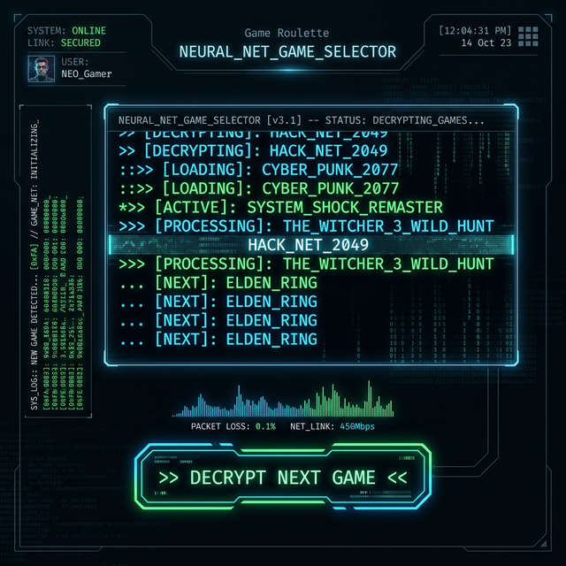

# Visualisatie: Game Roulette

Hier zijn twee conceptuele voorbeelden (mockups) van hoe de applicatie eruit zou kunnen zien. Dit geeft je een idee van het eindresultaat zonder dat ik de HTML/CSS code voor de lay-out verklap!

*(Let op: dit zijn conceptuele AI-gegenereerde designs en dienen puur ter inspiratie. Je hoeft het niet **exact** zo na te bouwen.)*

### 1. Het Startscherm (Initial State)
Hier zie je de applicatie in rust. Een strak dark theme, centraal het rad verdeeld in vele taartpuntjes (jouw ~108 games), en een overduidelijke "Spin" knop eronder.

### 2. De Winnaar (Winning State)
Hier zie je wat er moet gebeuren nadat het rad is uitgedraaid. De aandacht wordt verlegd naar het gewonnen spel door middel van een grote tekst of pop-up. Daaronder zie je (conceptueel) de knop die ervoor zorgt dat het spel uit de lijst verwijderd wordt en de app weer klaar is voor de volgende draai.

---

## 🎨 Uitgebreide Design Wensen van de Klant

De klant heeft na nader inzien een zeer specifieke visie voor het ontwerp gekregen. Dit "Rad van Fortuin" moet voelen als een moderne, gelikte applicatie. Hier is een uitgebreide opsomming van de eisen.

Je mag zelf bepalen **hoe** je dit in je CSS en HTML structureert, zolang je voldoet aan de onderstaande punten:

### 1. Algemene Vormgeving (Thema & Typografie)
*   **Thema:** Het moet een zeer uitgesproken, strak 'Dark Theme' hebben. Geen saaie witte schermen. Absoluut modern en web 3.0-achtig.
*   **Achtergrond (Body):** Gebruik niet zomaar één kleur, maar een subtiel kleurverloop ('linear-gradient' of 'radial-gradient'). Bijvoorbeeld beginnend vanuit een diep, donker blauwzwart (zoals `#0f172a`) in het midden, naar volledig pikzwart (`#000000`) aan de randen.
*   **Basis Tekstkleur:** Voor algemene leesbare tekst wil de klant een zacht lichtgrijs, zoals `#f8fafc` of `#cbd5e1`. Let goed op contrast: donkere achtergrond, lichte tekst.
*   **Typografie (Font):** De applicatie mag geen standaard browser lettertype (zoals Times New Roman) gebruiken.
    *   **Keuze 1:** Importeer een font via Google Fonts. De klant is fan van 'Inter', 'Roboto' of het speelse 'Outfit'.
    *   **Koppen (h1, h2):** Moeten extra gewicht (bold/black) en een ruime letterafstand ('letter-spacing') hebben om impact te maken.

### 2. Website Layout (De Grid Container)
*   De viewport moet altijd de volledige hoogte van het scherm in beslag nemen (zonder verticale of horizontale scrollbalken, tenzij absoluut noodzakelijk).
*   **Centrering:** De hoofdelementen uit de `main` sectie (Titel, Rad, Knop) móéten perfect in het midden van het scherm ('center center') worden uitgelijnd. Tip: Flexbox of CSS Grid is hiervoor perfect.
*   **Navigatiebalk (Header):** Aan de bovenkant moet het in de HTML gemaakte menu strak naast elkaar staan ('inline' of 'flex'). De linkjes in deze navigatiebalk:
    *   Mogen géén onderstreping ('text-decoration: none') hebben.
    *   Moeten bij aanraking van de muis ('hover') zichtbaar oplichten naar een accentkleur of wit (`#ffffff`), bij voorkeur gecombineerd met een soepele 'transition'.

### 3. Het Hoofdobject: Het Draaiende Rad
*   **Kleurgebruik Vlakken (Slices):** Aangezien er zoveel spellen zijn, moet het rad extreem kleurrijk zijn. De klant wil aaneengesloten, levendige ('vibrant') of zelfs neon/pastel kleuren. Bijvoorbeeld: neon roze (`#f472b6`), helder turquoise (`#2dd4bf`), of gifgroen (`#a3e635`). 
*   **Vormgeving Canvas:** Het canvas element zélf ("het wiel") moet perfect rond zijn.
*   **Omlijsting:** Geef het canvas (het wiel) een subtiele rand ('border') of, nog beter, een opvallende gloed (een flinke glow via 'box-shadow') in een accentkleur (bijv. `#3b82f6`) om het los te maken van de donkere achtergrond.
*   **Indicator (Wie wint?):** Er moet ergens rondom het rad een visuele stip, driehoekje of naald getekend/gemaakt worden (met HTML/CSS of binnenin het Javascript canvas) dat exact aanwijst wáár de winnaar wordt afgelezen. Dit moet absoluut onmiskenbaar zijn.

### 4. De Interactie: De Spin Knop
*   **Plaatsing:** Centraal direct onder of boven het rad.
*   **Uitstraling:** De knop mag er niet uitzien als een standaard HTML button. Maak hem groot, afgerond ('border-radius'), en geef hem een extreem opvallende, felle achtergrondkleur (bijvoorbeeld neon-paars, `#a855f7`, of brandweerrood).
*   **Tekst:** Grote letters (`font-size: 2rem` of meer), vetgedrukt, wit.
*   **Micro-animaties (Cruciaal voor de klant!):**
    *   **Hover State:** Als de speler met de muispijl over de knop zwerft (maar nog niet klikt), moet de knop groter lijken te worden (bijv. met `transform: scale(1.05)`) en mag de helderheid iets omhoog. Dit moet soepel verlopen via een overgang ('transition').
    *   **Active State:** Als de speler écht klikt, moet de knop iets wegzinken (bijv. `transform: scale(0.95)`), of alsof hij fysiek wordt ingedrukt.
    *   **Glow:** Voeg een flinke, uitwaaierende schaduwkleur toe onder de knop die matcht met de hoofdkleur.

### 5. Het Winnaar-Scherm (Feedback & Verwijderen)
*   **De Reveal:** Als het rad stopt na het draaien, wil de klant dat de naam van het winnende spel groot en theatraal in beeld knalt.
*   **Opmaak Resultaat:**
    *   Toon het winnende spel centraal in het beeld met een extreem groot lettertype (`font-size` dat echt impact maakt).
    *   Gebruik een knallende accentkleur (denk bijvoorbeeld aan felgoud (`#eab308`) of neonblauw) en een opvallende glans ('text-shadow').
    *   *Bonuswens:* Voeg een micro-animatie toe, zoals een tekst die even pulseert of zachtjes knippert ('keyframes' animatie).
*   **Verwijder / Ga door:** Onder of naast dit winnende resultaat moet een 'Accept / Verwijder' knop verschijnen. Deze knop moet er duidelijk ánders (bijvoorbeeld minder dominant, een zogenaamde 'ghost button' met alleen outlines) uitzien dan de gigantische Spin knop, maar het moet wel heel helder zijn voor de speler dat hij hierop moet drukken om het spel uit `localStorage` te knallen en door te gaan.

---

## 🌟 Alternatieve Layouts (Beginner-Friendly!)

Omdat een HTML Canvas rad met wiskunde (trigonometrie) best pittig is voor een eerste JavaScript project, staan hieronder drie haalbare, maar waanzinnig gave ontwerpen die je in de plaats kan bouwen. Deze focussen veel meer op standaard DOM manipulatie, arrays, timers en CSS!

Kies het design uit dat je het meest aanspreekt.

### Alternatief 1: De "Neon Slot Machine" (Roller)
In plaats van een rad, maak je een moderne, horizontale gokkast. De namen scrollen razendsnel in een balk voorbij, remmen af ('easing') en de winnaar eindigt exact in het middenvak.

**Wat je hier leert:**
*   **HTML/CSS:** Een verborgen balk (overflow: hidden) maken met daarin een lange lijst elementen.
*   **JavaScript:** Elementen selecteren, en met de `style.transform` de lijst op de Y- of X-as verschuiven (TranslateX) in een snelle loop.
*   **Look & Feel eisen:**
    *   Een donkere, glazen achtergrond ('glassmorphism' effect met `backdrop-filter: blur(10px)`).
    *   Felroze of cyaan accenten.
    *   Motion blur (vervagen van tekst) wanneer het heel snel gaat is een bonuswens!

### Alternatief 2: De "Cyberpunk Hacker Terminal" (Aanrader!)
Een ruwe, tech-achtige interface in een pikzwarte terminal. Bij een druk op de knop flitsen alle 108 titels letterlijk op de plek van de titel in sneltempo langs, alsof de computer aan het decoderen is. Dit ritme vertraagt dramatisch (`setTimeout`), totdat hij knipperend stilvalt op the Game.

**Wat je hier leert:**
*   **JavaScript:** Het briljant gebruiken van de timing events `setInterval` en `setTimeout` om snelheid over tijd aan te passen. Tevens leer je razendsnel innerText te vervangen.
*   **Kansberekening:** In plaats van graphics te sturen, stuur je random index uit de array rechtstreeks naar het scherm.
*   **Look & Feel eisen:**
    *   Een typografie met een "monospaced" (typemachine) lettertype, bijv. 'Courier New' of Google Font 'Fira Code' of 'Space Mono'.
    *   Kleur: Diepzwart veld (`#0a0a0a`), text in 'Matrix' groen (`#00ff00`) of Neon Blauw.
    *   De tekst moet tijdens het flitsen soms vreemde karakters ($, #, &) tussendoor tonen (Glitch effect).
    

### Alternatief 3: De 'Loot Crate' Reveal (Card Flip)
De applicatie toont een grote, glimmende gesloten kist of een kaart (op zijn kop). Met een spannende animatie, zodra je op "Reveal" klikt, flipt de kaart in 3D om, en daarop staat the Game die je gaat spelen geschreven.

**Wat je hier leert:**
*   **CSS Wizardry:** Je leert geavanceerde CSS classes bouwen, voornamelijk `transform: rotateY(180deg)` en `perspective` voor een écht lijkende flip-animatie in 3D.
*   **JavaScript Basics:** JavaScript doet hier de logica: array mixen, één uithalen, in de verborgen HTML-kant van de kaart plakken, en daarna de CSS-class 'flipped' toevoegen aan de structuur zodat hij daadwerkelijk draait.
*   **Look & Feel eisen:**
    *   Een "Premium" look. Denk aan goud (`#fbbf24`), diep paars (`#4c1d95`) of donkerblauw.
    *   De kist of kaart moet heel subtiel op en neer zweven in de ruimte (CSS `keyframes`).
    *   Wanneer geopend (de flip), moet er een stralenkrans of fel licht (drop-shadow) achter de kaart of kist vandaan komen.

### 🎥 Video Demonstratie (Loot Crate)
Omdat statische plaatjes niet altijd laten zien hoe vet 3D-CSS kan zijn, heb ik speciaal voor jou een kleine, werkende demo gebouwd en opgenomen op video. Zo zie je exact het eindresultaat dat de klant voor ogen heeft (inclusief hover-effecten, de 3D-flip, en het verschijnen van het resultaat).

