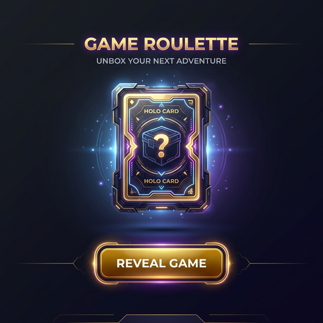

# Project Opdracht: Loot Crate Card Reveal (Game Roulette)

Beste Programmeur,

Welkom bij je nieuwe project! We gaan een applicatie bouwen die véél relevanter is in moderne web-development (en in games): **Een 3D flippende Loot Crate / Digital Card Reveal.**
Zie dit document als je officiële instructiehandboek. Lees de vereisten, designkeuzes en het stappenplan aandachtig door voordat je begint te coderen.

---

## 📅 1. Project Overzicht

**Klant:** Game Verzamelaar
**Project:** Card Flip Game Onthuller
**Doelstelling:**
Bouw een webapplicatie waarbij centraal op het scherm een gesloten "Loot Card" zweeft. Zodra de speler op de "Reveal Game"-knop drukt, draait deze kaart prachtig in 3D om, en onthult een willekeurig spel uit diens uitgebreide fysieke collectie.
Na de onthulling kan de speler ervoor kiezen dit spel definitief uit de collectie te schrappen en over te hevelen naar zijn "Gekozen Games" lijst.

---

## 🎨 2. Design Wensen & Huisstijl (Color Palette)

De klant wil een zeer "Premium" en "Dark" thema dat aanvoelt als een moderne game-interface. Gebruik exact de onderstaande elementen in je CSS:

### 🌈 Kleurenpalet (Direct uit de Mockup)

* **Achtergrond (Body):** Een diep donkere overgang (gradient) om de neon effecten te laten poppen.
  * *Startkleur Gradient:* `#0B0F19` (Zeer donker marineblauw, bovenaan)
  * *Eindkleur Gradient:* `#050505` (Bijna volledig zwart, onderaan)
* **Hoofdteksten (Leesbaarheid):**
  * *Tekstkleur:* `#E2E8F0` (Zacht lichtgrijs, minder hard voor de ogen dan puur wit)
* **Primaire Thema Kleuren (De Loot Crate zelf):**
  * *Kistkleur (Buitenkant):* `#2D1B4E` (Diep mystiek paars)
  * *Kistkleur (Binnenkant/Accenten):* `#4C1D95` (Iets feller paars)
* **Secundaire Accent / "Premium" Kleuren (Voor de Winnaar tekst, randen & Gloed):**
  * *Goud (Randen & Tekst):* `#FBBF24` (Fel goud/geel)
  * *Glow/Schaduw effect:* Gebruik `#FBBF24` met een transparantie (bijv. `rgba(251, 191, 36, 0.4)`) voor een prachtige gouden uitstraling rondom de kaart.

### ✍️ Typografie & Layout

* **Lettertype:** Gebruik een modern, strak, 'sans-serif' lettertype zoals `Segoe UI`, `Roboto` of `Inter` (via Google Fonts).
* **Layout:** Alles in de `<main>` sectie moet perfect gecentreerd in het midden van het scherm zweven (maak gebruik van Flexbox of Grid).
* **Animaties:**
  1. De gesloten kaart moet zachtjes op-en-neer zweven (CSS `@keyframes`).
  2. De knop moet "oplichten" en iets vergroten als je er met de muis overheen zweeft (CSS `:hover`).
  3. Wanneer de kaart geopend is, moet er een zachte, gouden gloed (CSS `box-shadow` of `drop-shadow`) vandaan komen.

### 🎴 Specifieke Component Design (De Kaart & De Knop)

De klant stelt hoge eisen aan de afwerking van de twee hoofdonderdelen. Zorg dat je CSS deze specifieke visuele regels volgt:

**1. De Loot Crate (De Kaart - `.card-face`)**

* **Vormgeving:** Geef de kaart afgeronde hoeken (`border-radius: 15px;`) en een dikke, opvallende gouden rand (`border: 2px of 4px solid #FBBF24;`).
* **De Voorkant (`.card-front`):**
  * *Achtergrond:* Een gradient van het donkere kist-paars (`#2D1B4E`) naar het lichtere paars (`#4C1D95`).
  * *Inhoud:* Een gigantisch, goudkleurig vraagteken (`?`) in het midden. Geef deze tekst een lichte drop-shadow.
* **De Achterkant (`.card-back`):**
  * *Achtergrond:* Een nóg donkerder patroon of verloop, zodat het resultaat echt nabij komt. Bijvoorbeeld van `#0B0F19` naar `#1a1a2e`.
  * *Inhoud (Winnaar):* De naam van de game in de gouden accentkleur (`#FBBF24`), dikgedrukt (`font-weight: bold;`), groot lettertype (`font-size: 2rem` of groter) en een flinke text-shadow (`text-shadow: 0 0 15px rgba(251, 191, 36, 0.8)`).
* **Interactie (Tip):** Voeg op de hele container (`.card` of `.scene`) `cursor: pointer;` toe zodat de speler weet dat het klikbaar is.

**2. De Reveal Knop (`button`)**

* **Vormgeving:** Het mag geen standaard saai grijs knopje zijn.
  * *Achtergrond:* Gebruik je primaire paarse of cyaan accentkleur (bijv. `#4C1D95` en `#2D1B4E` in een verloop).
  * *Randen:* Volledig afgerond, een zogenaamde "pill shape" (`border-radius: 30px;`) en gebruik `padding: 15px 40px;` om hem lekker dik te maken.
  * *Randkleur (Border):* Geef het ook een dunne gouden border voor die premium feel.
  * *Tekst:* Wit (`#ffffff`), in Hoofdletters (`text-transform: uppercase;`), dikgedrukt, met wat ruimte tussen de letters (`letter-spacing: 2px;`).
* **Micro-Animaties (Hover & Active state):** Dit is cruciaal voor de klant!
  * *Hover State (`button:hover`):* Als je er met de muis overheen glijdt, moet de knop qua formaat iets vergroten (`transform: scale(1.05);`). De achtergrondkleur mag iets lichter worden. **Extra wens:** Laat hier een gouden schaduw onder verschijnen! (`box-shadow: 0 0 25px rgba(251, 191, 36, 0.5);`).
  * *Active State (`button:active`):* Als je echt klikt, moet het lijken alsof de knop wordt ingedrukt: `transform: scale(0.95);`.
  * *Transitie:* Vergeet niet een algemene `transition: all 0.3s ease;` op de knop te zetten, anders gebeuren deze effecten té bruut in plaats van vloeiend.

---

## 📋 3. Functionele Eisen (De Logica)

Je JavaScript code en HTML structuur moeten het volgende kunnen:

1. **Games Inladen:** Gebruik de array uit `scripts/games.ts` als je bronbestand.
2. **Interactieve Kaart:** Plaats een HTML element centraal op het scherm dat dient als de kaart (voor- én achterkant).
3. **Onthullingsknop:** Plaats een grote, opvallende knop (gebruik de primaire accentkleur) om te "Spinnen/Onthullen".
4. **De 3D Flip Animatie:** De kaart moet op de Y-as in 3D draaien (`rotateY`) als er op de knop geklikt is.
5. **Winnaar Berekenen:** Zodra geklikt is, kiest JavaScript *willekeurig* één spel uit de actieve array en zet deze tekst onzichtbaar op de achterkant van de kaart, nét voordat deze omdraait.
6. **Gekozen Spel Opslaan:** Na onthulling toon je een tweede knop ("Accepteer Spel"). Als hierop geklikt wordt:
   * Verwijder je het spel uit je *actieve* lijst.
   * Voeg je het spel toe aan een nieuwe *gekozen* lijst.
7. **Data Opslag:** Sla beide lijsten (de overgebleven én de gespeelde games) op in de `localStorage` van de browser. Check altijd de `localStorage` bij het herladen in plaats van automatisch opnieuw te beginnen.
8. **Eindbericht:** Check in je code of de actieve array leeg is. Zo ja? Blokkeer de boel en toon een melding/alert: "Je bent door al de spellen heen!".
9. **Overzichtspagina (`Games.html`):** Maak een tweede HTML-pagina mét bijbehorend JavaScript. Lees hier de opgeslagen 'Gekozen Games' lijst uit en print ze als een galerij/grid op je scherm, eventueel voorbereid om later afbeeldingen te tonen.

---

## 🗺️ 4. Stappenplan (Jouw Roadmap)

Werk stap voor stap. Probeer dit niet allemaal tegelijk te bouwen!

### Stap 1: Het Skelet & Design

Bouw je `<main>`, je `<button>`, en implementeer het "CSS Card Flip 3D effect".

```html
<div class="scene">
   <div class="card" id="lootCard">
      <div class="card-face card-front">?</div>
      <div class="card-face card-back" id="winner-text">Resultaat...</div>
   </div>
</div>
```

*Zoek online naar "CSS 3D flip card" voor de specifieke `perspective` en `transform-style: preserve-3d` regels.* Voer ook alle kleuren uit Sectie 2 door.

### Stap 2: Data Controleren

Maak in je JavaScript variabelen voor `activeGames` en `playedGames`. Check of deze in `localStorage` staan (en gebruik `JSON.parse()`). Zo niet, vul `activeGames` dan met de inhoud uit `games.ts`.

### Stap 3: De Onthulling (De "Klik")

Hang een `addEventListener` aan je eerste knop.

* Zorg dat je een random getal berekent op basis van je array-lengte.
* Zet de tekst in `#winner-text`.
* Voeg een `.is-flipped` CSS class toe aan je `.card` element via JavaScript (`classList.toggle`).

### Stap 4: Het Acceptatie-proces

Maak een tweede knop zichtbaar. Zodra je hierop klikt doe je het volgende in je JS array:

* Haal we uit array A (`.splice()`).
* Stop het in array B (`.push()`).
* Sla direct daarna beide arrays op in `localStorage` (`JSON.stringify()`).
* Check óf de lijst nu leeg is, en geef een alert ("Alles is gespeeld!").
* Draai de kaart terug.

### Stap 5: De `Games.html` Pagina

Maak een nieuwe HTML file. Bouw een simpele `<div id="games-grid"></div>`. Lees via JS je `playedGames` uit je `localStorage`, gebruik een `forEach` loop en schrijf de namen middels `innerHTML` naar het grid om een mooi weergave-archief te bouwen.

---

## 🎨 5. Design Mockup & Inspiratie

Hieronder vind je beelden van het beoogde eindresultaat. Richt je op deze "Premium" layout!

*Vergeet niet je video-demo te bekijken via Mockups.md om de 3D-flip en glow-animaties in actie te zien!*


